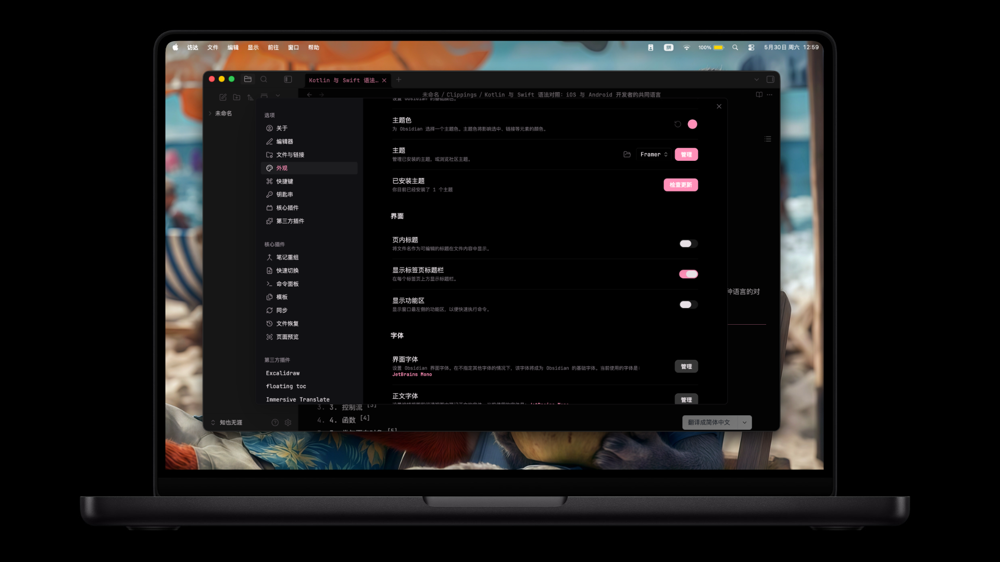

# Framer Theme

A clean, polished Obsidian theme inspired by [Framer](https://www.framer.com)'s design system. The theme adapts to both dark and light appearances with carefully curated accent colors — hot pink in dark mode and rose gold in light mode. Every color has been tuned for WCAG-compliant contrast while maintaining a soft, feminine aesthetic.

Built-in CSS classes let you switch accent colors on the fly: `accent-blue`, `accent-cyan`, and `accent-purple` are fully supported for both heading gradients and canvas node colors.

The theme also includes optional style snippets: a floating status bar, Framer-style drag indicators, a component browser search panel, and more.

> **Version 1.2.2** — see [AGENTS.md](./AGENTS.md) for full changelog.

## Screenshots



*Dark mode with hot pink accents*
<!-- Replace with a light mode screenshot once available -->

## Features

- **Dark mode**: Hot pink accents (`#FF8FB8`) on black canvas
- **Light mode**: Rose gold accents (`#C4837A`) on warm cream background (`#FDF8F5`)
- **Accent variants**: Built-in classes for `accent-blue`, `accent-cyan`, `accent-purple` — switch via Style Settings or custom CSS
- **Floating status bar**: Optionally slides in from the right on hover
- **Framer-style UI**: Sidebar, panels, and component browser borrow visual patterns from Framer's design tool
- **WCAG-friendly**: All color pairs pass AA contrast requirements in both appearances
- **Smooth transitions**: Subtle animations on hover, selection, and panel interactions
- **Canvas support**: Color-matched canvas node backgrounds and connection points
- **CodeMirror 6**: Properly styled editor with theme-aware syntax highlighting

## Installation

### From Obsidian Community Themes

1. Open Obsidian → Settings → Appearance
2. Under **Themes**, click **Manage**
3. Click **Browse** and search for "Framer"
4. Click **Install**

### Manual Installation

1. Download or clone this repository
2. Copy the `Framer/` folder into your vault's `.obsidian/themes/` directory
3. Go to Settings → Appearance → Themes and select **Framer**

## Usage

### Accent Variants

Add any of these classes to your `body` element (via CSS snippets or Style Settings):

```css
body.accent-blue   { /* replaces brand with #42A5F5 */ }
body.accent-cyan   { /* replaces brand with #00BCD4 */ }
body.accent-purple { /* replaces brand with #AB47BC */ }
```

Each variant updates heading gradients, canvas node colors, and all brand-colored UI elements.

### Optional Snippets

The theme includes several built-in snippet classes (toggle via Style Settings):

- `body.framer-floating-statusbar` — Status bar auto-hides and slides in from the right
- `body.framer-drag-indicator` — Framer-style dot indicators on drag-and-drop operations
- `body.framer-search` — Sidebar search styled like Framer's component browser
- `body.framer-tags-panel` — Tags panel with dot indicators
- `body.framer-backlinks` — Embedded notes with frame-style borders and title bars

## Color Palette

| Token | Dark | Light |
|-------|------|-------|
| `--color-bg` | `#000000` | `#FDF8F5` |
| `--color-surface` | `#000000` | `#FFFFFF` |
| `--color-brand` | `#FF8FB8` | `#C4837A` |
| `--color-hot` | `#FF5FA2` | `#D49088` |
| `--color-text` | `#E7E0E5` | `#4A3F3D` |

## Changelog

See [AGENTS.md](./AGENTS.md) for the version history and detailed change log.

## Credits

Created by [TheViviana](https://github.com/TheViviana).
